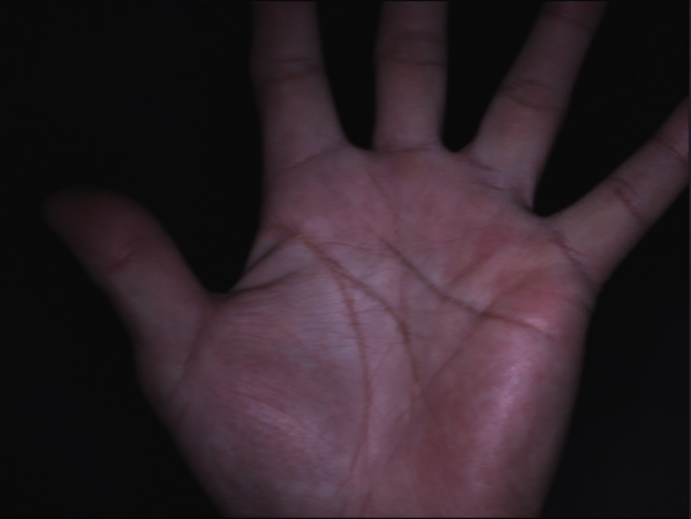
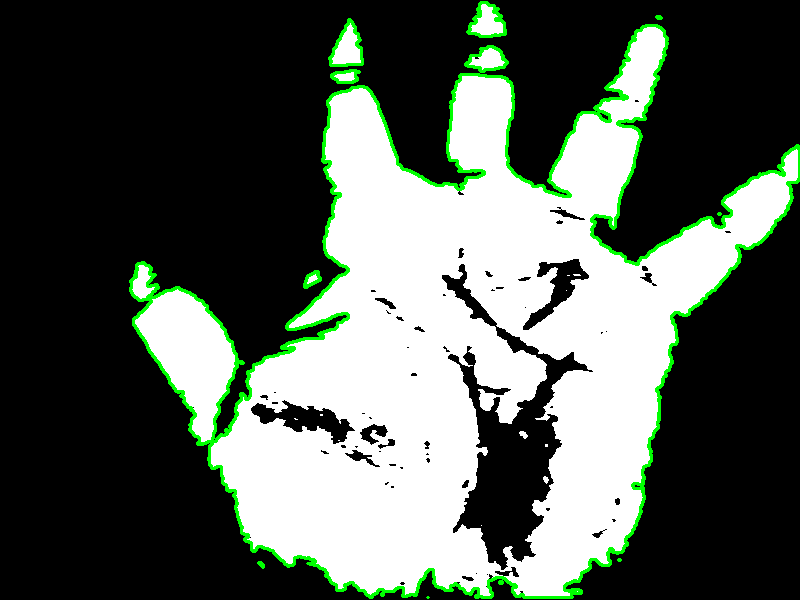
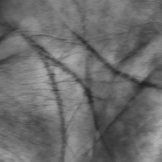
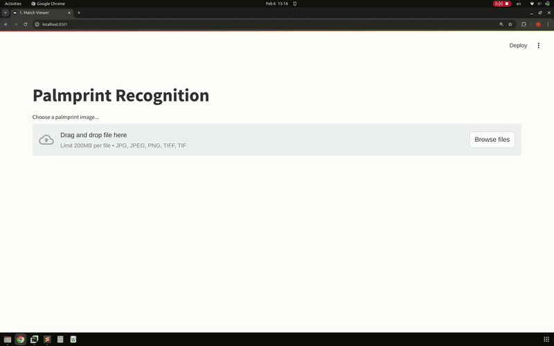

# Palmprint Recognition for Authentication using Self-Supervised Learning

## Project Goal and Approach


This project implements a palmprint recognition system for authentication purposes. Due to the lack of labeled data for training, a self-supervised learning approach was adopted to learn meaningful feature representations from a large dataset of unlabeled palmprint images. The system utilizes contrastive learning to train a deep neural network to extract discriminative features, enabling palmprint matching and similarity comparison.  Finally, a user-friendly web interface was built to demonstrate the system's functionality.

## Dataset Description
For this project, a dataset of **12,000 unlabeled palmprint images** was used. The images are in **TIFF format** and were **obtained from the "Kaggle Palm Recognition Dataset for Authentication System"** dataset available on Kaggle ([https://www.kaggle.com/datasets/saqibshoaibdz/palm-dataset/data](https://www.kaggle.com/datasets/saqibshoaibdz/palm-dataset/data)).

This dataset is described as containing high-quality images designed for training and evaluating palm recognition models for biometric authentication.  While the original dataset includes categories for palm detection, palm vein patterns, and palm print matching, this project utilizes the **palmprint images suitable for palm print matching**. The dataset consists of images with **relatively high quality, designed for real-world biometric authentication applications.** The images are expected to exhibit variations inherent in biometric data collection, but are generally intended to be high-quality for effective model training. Each image in the dataset is also associated with metadata within the original Kaggle dataset, though this project focuses on the image data itself for self-supervised learning.

*   **Number of images:** 12,000
*   **Type of images:** Palmprint images
*   **Labeled or Unlabeled:** Unlabeled data
*   **Image format:** TIFF images
*   **Source:**  [Palm Recognition Dataset for Authentication System from Kaggle](https://www.kaggle.com/datasets/saqibshoaibdz/palm-dataset/data)
*   **Characteristics:** Images typically feature a dark background, which aids in segmenting the palm region from the surroundings. The dataset likely contains multiple images of palmprints from the same individual, reflecting a realistic biometric authentication scenario and hinting at potential for future identity-based analysis.While designed to be high quality, the dataset likely includes natural variations in palm appearance due to individual differences, minor pose variations, and subtle changes in skin texture.

## Image Preprocessing

Before feature extraction, palmprint images undergo a preprocessing pipeline to enhance relevant features and standardize the input for the model. The key stages are:

1.  **Grayscale Conversion:** The input color palmprint image (if any) is converted to grayscale to simplify processing and focus on texture and line patterns.
2.  **Contrast Enhancement (CLAHE - Contrast Limited Adaptive Histogram Equalization):**  CLAHE is applied to improve the local contrast of the palmprint image, making the lines and ridges more prominent and easier to detect. This uses a clip limit of `2.0` and a tile grid size of `(5, 5)`.
3.  **Noise Reduction (Median Blur):** Median Blur with a kernel size of `1` is used to reduce noise while preserving edges.  While a kernel size of `1` effectively means minimal blurring, this step is included for potential future noise reduction adjustments.
4.  **Palm Segmentation (Thresholding and Contour Extraction):**  A thresholding technique (using a `threshold_value` of `80`) is applied to create a binary mask, separating the palm region (foreground) from the background.  Contours are then extracted to identify the palm's outline.
5.  **Region of Interest (ROI) Extraction (Centroid-Based):**  The Region of Interest (ROI) is extracted by finding the centroid (center of mass) of the largest contour (assumed to be the palm). A fixed-size square ROI of `(276x276)` pixels, centered at this centroid, is then cropped from the contrast-enhanced and noise-reduced grayscale image.
6.  **ROI Resizing:** The extracted ROI is resized to a standardized `(138x138)` pixel size to ensure consistent input dimensions for the feature extraction model.
7.  **ROI Normalization:** Finally, the pixel values of the resized ROI are normalized to the range of `[0, 1]` by dividing by `255.0`. This step helps in stabilizing and accelerating the training of the deep learning model.

### **Example Preprocessing Stages:**

Below are example images illustrating the key stages of the preprocessing pipeline applied to a sample palmprint image from the dataset, displayed in a horizontal flow:

<table>
  <tr>
    <td align="center">
      (1) Original Image:<br>
      <br>
    </td>
    <td align="center"> → </td>  <!-- Arrow -->
    <td align="center">
      (2) Grayscale Conversion:<br>
      <br>
    </td>
    <td align="center"> → </td>  <!-- Arrow -->
    <td align="center">
      (3) Contrast Enhanced (CLAHE):<br>
      <br>
    </td>
    <td align="center"> → </td>  <!-- Arrow -->
    <td align="center">
      (4) Noise Reduction: <br>
      <br>
    </td>
    <td align="center"> → </td>  <!-- Arrow -->
    <td align="center">
      (5) Contour Extraction: <br>
      <br>
    </td>
    <td align="center"> → </td>  <!-- Arrow -->
    <td align="center">
      (6) (ROI) Extraction: <br>
      <br>
    </td>
    <td align="center"> → </td>  <!-- Arrow -->
    <td align="center">
      (7) ROI Resizing: <br>
      <br>
    </td>
    <td align="center"> → </td>  <!-- Arrow -->
    <td align="center">
      (8) ROI Normalization: <br>
      <br>
    </td>
    <td align="center"> → </td>  <!-- Arrow -->
    <td align="center">
      (9) Final Preprocess Result: <br>
      <br>
    </td>
  </tr>
</table>


---
## Self-Supervised Learning Method Used

This project employed a **contrastive learning** approach, specifically inspired by **SimCLR (Simple Contrastive Learning for Representations)**.  Since the dataset is unlabeled, self-supervised learning was crucial to learn meaningful feature representations.

The SimCLR-inspired method works by:
1.  **Creating positive pairs:** For each palmprint image in a batch, two augmented versions are generated using various image transformations (see "Data Augmentation" section). These two augmented views of the same palmprint form a "positive pair."
2.  **Creating negative pairs:** Augmented views from different original palmprint images within the same batch are treated as "negative pairs."
3.  **Training objective:** The model is trained to learn feature representations (embeddings) such that:
    *   Embeddings of positive pairs are pulled closer together in the feature space.
    *   Embeddings of negative pairs are pushed further apart.

This contrastive objective forces the model to learn features that are invariant to the applied augmentations and discriminative between different palmprints, all without requiring explicit labels.

**Loss Function:** The training process utilizes the **NT-Xent (Normalized Temperature-scaled Cross Entropy) Loss** function to achieve this objective. This loss function, with a **temperature parameter of 0.07**, encourages similar embeddings for positive pairs and dissimilar embeddings for negative pairs in a normalized embedding space. By minimizing this loss, the model learns to extract robust and discriminative features from the unlabeled palmprint images.

## Model Architecture

<table>
  <tr>
    <td>
      <p align="center">
        <a href="output/model/7.%20palmprint_encoder.onnx.svg">
          
        </a>
</p>
    </td>
    <td>
      <p>
The feature extraction model is based on a <strong>ResNet-18</strong> Convolutional Neural Network (CNN) architecture.  The <strong>encoder</strong> part of the model utilizes a <strong>ResNet-18 backbone</strong>, initialized with weights <strong>pre-trained on ImageNet</strong>.  The original classification head of the pre-trained ResNet-18 was removed, and a <strong>2-layer Multilayer Perceptron (MLP) projection head</strong> was added on top of the encoder's output features.
        <br><br>
Specifically, the projection head consists of two linear layers with a ReLU activation function in between. This projection head further processes the features extracted by the ResNet-18 encoder before outputting the final <strong>256-dimensional feature embeddings</strong>.
        <br><br>
This architecture was chosen to leverage the powerful feature extraction capabilities of the ResNet-18 architecture, which is pre-trained on a large image dataset (ImageNet). The projection head is used to learn effective representations suitable for the contrastive learning task, mapping the ResNet-18 features into a lower-dimensional embedding space optimized for similarity comparisons. The model is trained to output <strong>256-dimensional feature embeddings</strong> for each input palmprint image.
      </p>
    </td>
  </tr>
</table>


## Training Process

The self-supervised model was trained using PyTorch. The training process involved:

*   **Framework:** PyTorch
*   **Optimizer:** Adam optimizer with a learning rate of `1e-4` (0.0001)
*   **Loss Function:** NT-Xent (Normalized Temperature-scaled Cross Entropy) Loss with a temperature of `0.07`
*   **Training Epochs:** 100 epochs
*   **Batch Size:** 64
*   **Data Augmentations:** During training, the following data augmentations were applied to generate positive pairs:
    *   `RandomResizedCrop`
    *   `RandomRotation` (small angles)
    *   `ColorJitter` (grayscale - brightness and contrast adjustments)
    *   `GaussianBlur`
*   **Training Procedure:** The training loss was monitored, and the model weights were updated using backpropagation with the Adam optimizer to minimize the NT-Xent loss. The model learned to create embeddings where augmented views of the same palmprint are close together, and views of different palmprints are far apart in the embedding space.

## UI Functionality

*   **Framework used:** Streamlit
*   **Key features:** Image upload, display of uploaded image, display of top matching palmprints from database, similarity scores, indication of match/no match.

A simple and interactive web user interface was developed using **Streamlit** to demonstrate the palmprint recognition system. The UI provides the following functionalities:

*   **Image Upload:** Users can upload a palmprint image file (JPG, JPEG, PNG, TIFF).
*   **Uploaded Image Display:** The uploaded palmprint image is displayed on the UI.
*   **Matching Results Display:**  Upon uploading an image, the system compares it against a database of 11996 images pre-extracted palmprint features.
*   **Top Matching Palmprints:** The UI displays the top matches of 5 most similar palmprint images from the database, along with their cosine similarity scores.
*   **Match Indication:** The UI indicates whether a "match" is found based on a predefined similarity threshold value of 80%.

The UI allows users to easily test the palmprint recognition system by uploading their own palmprint images and observing the matching results in real-time.



_The demo showcases the palmprint recognition system's ability to identify palmprints from the same individual.  By using one of the original palmprint images (that was excluded from the training dataset), the model successfully located the other corresponding palmprint images in the database (from the same person) with similarity scores consistently around 90%._

## How to Run the Code

To run this project, navigate to the project directory, follow these steps:

1.  **Install Libraries:** 
    ```bash
    pip install -r requirements.txt
    ```
2. **Run the Streamlit UI:**

    ```bash
    streamlit run app.py
    ```

3. **Access the UI:**  Open your web browser and go to the address provided by Streamlit (usually `http://localhost:8501`).

## Key Libraries Used

*   **PyTorch:** Deep learning framework for model building and training.
*   **torchvision:** PyTorch's library for computer vision tasks, including pre-trained models and image transformations.
*   **OpenCV (cv2):**  Image processing library for preprocessing steps.
*   **NumPy:** Numerical computing library for array operations and data handling.
*   **Streamlit:** Python framework for building interactive web UIs.
*   **scikit-learn (sklearn):** Machine learning library, used for cosine similarity calculation.
*   **PIL (Pillow):** Python Imaging Library for image handling (used via Streamlit).

---
```text
@article{wang2024ai,
  author = {Wang, C. and Wu, X. and Liu, J.},
  title = {A Review on Recent Advances in AI-Driven Image Processing},
  journal = {Applied Sciences},
  volume = {14},
  number = {1},
  pages = {153},
  year = {2024},
  doi = {10.3390/app14010153},
  url = {https://www.mdpi.com/2076-3417/14/1/153}
}
```

_Lucy Tran_
_2025-02-06_